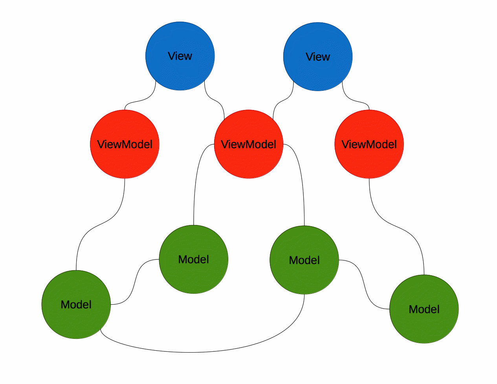
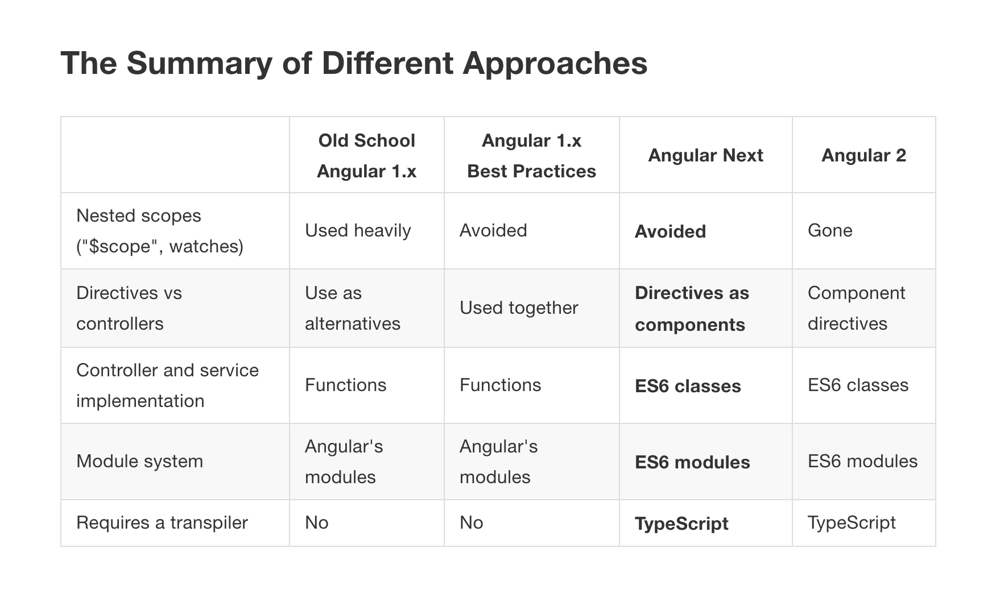

# AngularJS1-review
This is a personal review of AngularJS1.X to wrap up my thoughts, after these years of working while reading [rangleio blogs](https://ngcourse-1.rangle.io/).

Iy may take a long time to complete, but will helps me to get to stages every few weeks.

## Setup
- For Mac OS X, [iTerm2](http://iterm2.com/) is recommended. Believe me, it's awesome.
- Install [Angular Batarang](https://chrome.google.com/webstore/detail/angularjs-batarang/ighdmehidhipcmcojjgiloacoafjmpfk?hl=en), which is an Google Chrome extension that makes it easier to debug and inspect Angular applications
- [Postman](https://www.getpostman.com/) is the preferred tool for interacting with a REST API server.

## Intro
AngularJS 1.x does not have nearly the same kind of warts as JavaScript, but it does have features that will help you shoot yourself in the foot, even as many of its other features help you build highly scalable software.

```
The upcoming Angular 2 brings a number of changes. Some of those changes involve removing those parts of Angular that have proved
to not work well. Other changes involve borrowing the best ideas from outside the Angular ecosystem. Finally, another large set of
changes aims to take advantage of new features that are becoming available in ES6, the new version of JavaScript.
```

***AngularJS is often described as an MVC ("Model-View-Controller") framework (however, is far too simple!).***

However. "Controllers" are replaced with "View mMdels". Angular can be better understood as a "MVVM" ("Model-View-ViewModel") framework.



`Model = data`

`View = HTML templates that are extended with custom elements and attributes called "directives".`

`ViewModel = $scope/Controlers`


```
only the most trivial applications can be understood as consisting of a single model, a single view and a
single controller. More commonly, an application will include multiple views, multiple controllers, and multiple
data models. So, it might look more like this:
```
Notes:

- Angular 2 merges "controllers" and "directives" into a single concept of a "component".
- Angular 1.x also has a concept of "two-way databinding", where properties of the view model can be automatically changed to reflect changes to DOM properties. This approach is deprecated in Angular 2 and we will avoid it.
- Angular 1.x allows you to organize your view models into a hierarchy of "scopes" that partly mirrors DOM structure. This approach has proven problematic and we've usually recommended against it. It is being dropped entirely in Angular 2. 

- AngularJS automatically synchronizes DOM with view models when the view model changes. It also allows us to associate function handlers with DOM events. Both of those methods are preserved and generalized in Angular 2, 4, 5 and later versions.
- Angular's approach to view synchronization makes it very "designer-friendly": designers can modify HTML templates without worrying too much about the code. The reverse is also true: as long as there is a designer on the team, developers are largely freed from worrying about HTML and CSS. Angular 2 preserves this feature.



